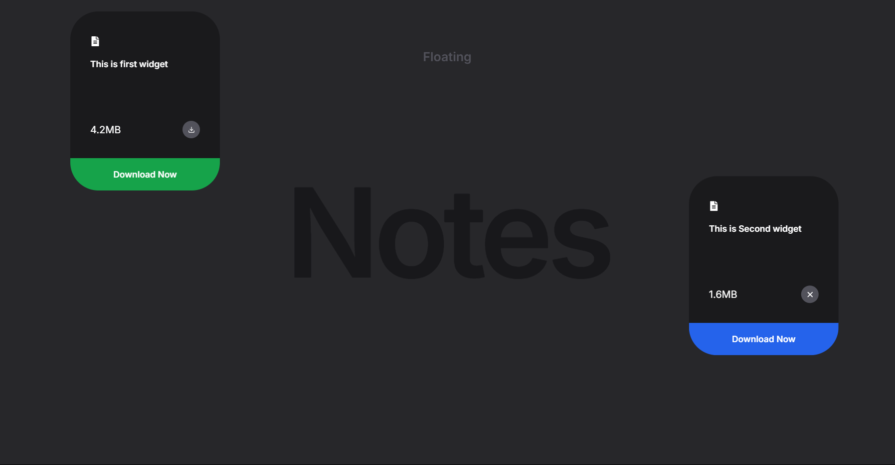
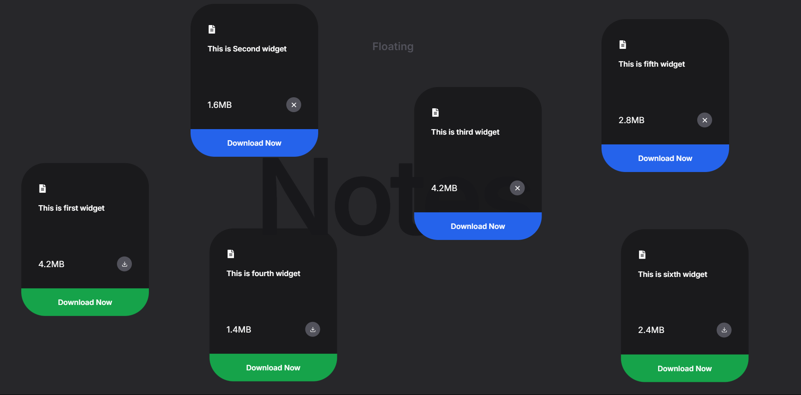

# 📝 Floating Notes – A Playful Visual Prototype

  
  
  

## 🌟 About the Project

**Floating Notes** is a visually engaging prototype where cards "float" and bounce on screen. You can **manually add cards via code**, and once they appear, they:

- 🧲 Bounce with playful physics  
- 🖱️ Are draggable anywhere in the window  
- 🎨 Act as a canvas for future productivity features  

It's currently a **visual prototype**, but it’s a living project — more features like note editing, saving, and multi-device sync are on the way.

---

## ⚡ Features

- 🪄 Visually animated floating notes  
- 🖼️ Clean and minimal design  
- 🖱️ Smooth drag-and-drop interactions  
- 🔧 Built with flexibility for future enhancements

---

## 🚧 Roadmap

- [ ] Add a UI to create notes without touching code  
- [ ] Implement persistent storage (LocalStorage/Database)  
- [ ] Add edit/delete functionality  
- [ ] Markdown support  
- [ ] Multi-device sync  
- [ ] Collaborative mode  

---

## 💡 Contributing

We’d love help from the community to shape this into a powerful tool!

- Fork the repo  
- Create a new branch (`git checkout -b feature-xyz`)  
- Commit your changes  
- Push and open a Pull Request 🎉  

New ideas, animations, and features are welcome — this is a creative space!

---

## 🛠 Tech Stack

- React / JavaScript  
- CSS Animations  
- Framer Motion (or similar for motion effects)

---

## 📸 Screenshots

---

## 📬 Contact

Have suggestions ?

---

> ⚠️ _This is an open prototype. Expect bugs, magic, and big changes._

---

<b>⭐️ Give the project a star if you like it!</b>

